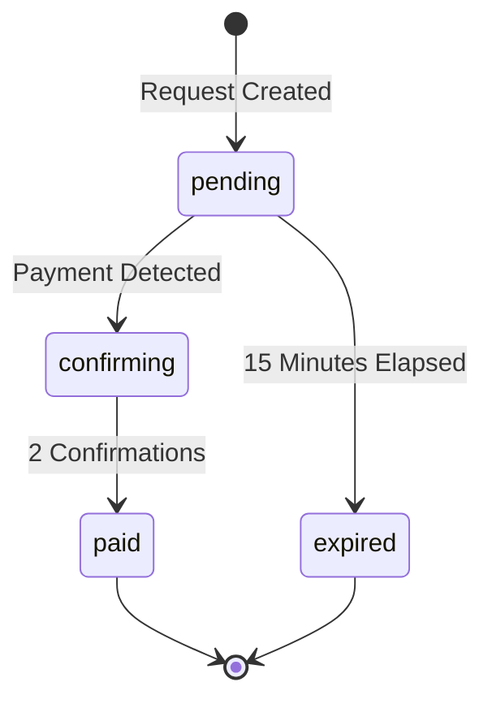

## Overview

Payment Requests allow business accounts to accept cryptocurrency payments from customers through QR codes and public payment links. Each payment request is tracked on-chain and verified through the Polygon blockchain.

<Note>
Payment Requests are exclusively available to **business accounts**. Personal accounts cannot create or manage payment requests.
</Note>

## Supported Tokens

Payment requests support the following stablecoins on **Polygon (Chain ID: 137)**:

<CardGroup cols={2}>
  <Card title="USDC" icon="dollar-sign">
    USD Coin on Polygon network
  </Card>
  <Card title="USDT" icon="dollar-sign">
    Tether on Polygon network
  </Card>
</CardGroup>

## Creating a Payment Request

<Steps>
  <Step title="Business Account Required">
    Ensure you have a business account (`userType: "business"`) with at least one linked wallet address.
  </Step>
  
  <Step title="Submit Payment Details">
    Create a payment request by providing:
    - **Amount in USD**: The payment amount (e.g., `"10.00"`)
    - **Token**: Either `USDC` or `USDT`
    - **Merchant Wallet Address**: Must be linked to your business account
    - **Split Payment** (optional): Enable to accept partial payments from multiple payers
  </Step>
  
  <Step title="QR Code Generation">
    The system generates:
    - A unique payment request ID (UUID)
    - A public payment URL: `https://yourdomain.com/pay/{requestId}`
    - A QR code encoding the payment URL
    - Starting block number for blockchain scanning
  </Step>
</Steps>

### API Endpoint

```typescript
POST /api/payment-requests
Content-Type: application/json

{
  "amountUsd": "25.00",
  "token": "USDC",
  "merchantWalletAddress": "0x742d35Cc6634C0532925a3b844Bc9e7595f0bEb",
  "isSplitPayment": false
}
```

<Info>
The merchant wallet address must already be linked to your business account through the `addresses` table.
</Info>

## Payment Request Lifecycle

### Status Flow



### Status Descriptions

| Status | Description |
|--------|-------------|
| `pending` | Awaiting payment from customer |
| `confirming` | Payment detected, waiting for blockchain confirmations |
| `paid` | Payment confirmed on-chain |
| `expired` | Request expired after 15 minutes |
| `cancelled` | Manually cancelled by merchant |

## Expiry and Confirmations

<CardGroup cols={2}>
  <Card title="15-Minute Expiry" icon="clock">
    Payment requests expire **15 minutes** after creation. Payments received after expiry are not matched to the request.
  </Card>
  <Card title="2 Block Confirmations" icon="check-double">
    Payments require **2 block confirmations** on Polygon before being marked as `paid`.
  </Card>
</CardGroup>

### Configuration Constants

```typescript
// lib/payments/config.ts
export const PAYMENT_EXPIRY_MINUTES = 15
export const PAYMENT_REQUIRED_CONFIRMATIONS = 2
export const PAYMENT_CHAIN_ID = 137 // Polygon
```

## Blockchain Verification

Walty uses on-chain event scanning to verify payments without relying on webhooks or third-party services.

### How It Works

<Steps>
  <Step title="Event Monitoring">
    The reconciliation service scans for ERC-20 `Transfer` events to the merchant's wallet address starting from the payment request creation block.
  </Step>
  
  <Step title="Amount Matching">
    For standard (non-split) payments, the transfer amount must **exactly match** the requested token amount.
  </Step>
  
  <Step title="Timestamp Validation">
    The transaction block timestamp must be **before** the payment request expiry time.
  </Step>
  
  <Step title="Confirmation Tracking">
    The system tracks block confirmations and updates the payment status from `confirming` to `paid` once the required confirmations are reached.
  </Step>
</Steps>

### Reconciliation Process

```typescript
// Automatically runs every 30 seconds
export const PAYMENT_RECONCILE_INTERVAL_SECONDS = 30
```

The reconciliation service (`reconcilePendingPaymentRequests.ts:reconcilePendingPaymentRequests`):

1. Queries all `pending` and `confirming` payment requests
2. Scans blockchain logs for matching transfers
3. Updates payment status and confirmation counts
4. Marks expired requests that exceed the 15-minute window

<Warning>
The reconciliation service prevents duplicate transaction claims by checking if a transaction hash is already associated with another payment request.
</Warning>

## Split Payments

Split payments allow multiple customers to contribute toward a single payment request, useful for group orders or shared bills.

### How Split Payments Work

<Steps>
  <Step title="Enable Split Payment">
    Set `isSplitPayment: true` when creating the payment request.
  </Step>
  
  <Step title="Accept Multiple Contributions">
    Each customer can send any amount to the merchant wallet. All transfers are tracked as separate contributions.
  </Step>
  
  <Step title="Track Progress">
    The system maintains:
    - `totalPaidToken`: Sum of all contributions in token units
    - `totalPaidUsd`: Sum of all contributions in USD
    - `remainingAmountUsd`: Amount still needed to complete payment
  </Step>
  
  <Step title="Automatic Completion">
    When `totalPaidToken >= amountToken`, the request status changes to `paid`.
  </Step>
</Steps>

### Split Payment Data Structure

Each contribution is stored in the `split_payment_contributions` table:

```typescript
{
  id: number
  paymentRequestId: string
  txHash: string
  payerAddress: string
  amountToken: string
  amountUsd: string
  tokenSymbol: string
  confirmations: number
  status: "pending" | "confirming" | "confirmed"
  blockNumber: string | null
  detectedAt: string | null
  confirmedAt: string | null
}
```

<Info>
Contributions are verified independently—each must reach 2 confirmations before being marked as `confirmed`, but the overall payment request becomes `paid` once the total amount is reached.
</Info>

## Monitoring Active Requests

### Get Active Payment Request

Retrieve the most recent active payment request for your business account:

```typescript
GET /api/payment-requests
```

Returns the latest `pending` or `confirming` payment request, or `null` if none exists.

### Get Specific Payment Request

```typescript
GET /api/payment-requests/{id}
```

Returns the full payment request details, including contributions for split payments.

### Real-Time Updates

The POS system polls for updates every 3 seconds:

```typescript
export const PAYMENT_MODAL_POLL_INTERVAL_MS = 3_000
```

## Database Schema

### Payment Requests Table

```sql
CREATE TABLE payment_requests (
  id UUID PRIMARY KEY DEFAULT gen_random_uuid(),
  merchant_id INTEGER NOT NULL REFERENCES users(id),
  chain_id INTEGER NOT NULL DEFAULT 137,
  amount_usd TEXT NOT NULL,
  amount_token TEXT NOT NULL,
  token_symbol TEXT NOT NULL,
  token_address TEXT NOT NULL,
  token_decimals INTEGER NOT NULL,
  wallet_address TEXT NOT NULL,
  status TEXT NOT NULL DEFAULT 'pending',
  tx_hash TEXT UNIQUE,
  tx_block_number TEXT,
  payer_address TEXT,
  start_block TEXT NOT NULL,
  last_scanned_block TEXT NOT NULL,
  confirmations INTEGER NOT NULL DEFAULT 0,
  required_confirmations INTEGER NOT NULL DEFAULT 2,
  detected_at TIMESTAMP,
  paid_at TIMESTAMP,
  created_at TIMESTAMP NOT NULL DEFAULT NOW(),
  updated_at TIMESTAMP NOT NULL DEFAULT NOW(),
  expires_at TIMESTAMP NOT NULL,
  is_split_payment BOOLEAN NOT NULL DEFAULT false,
  total_paid_token TEXT DEFAULT '0',
  total_paid_usd TEXT DEFAULT '0'
);
```

## Security Considerations

<CardGroup cols={2}>
  <Card title="Business Account Only" icon="shield-check">
    Only users with `userType: "business"` can create or manage payment requests.
  </Card>
  <Card title="Address Verification" icon="link">
    Merchant wallet addresses must be pre-linked to the business account in the `addresses` table.
  </Card>
  <Card title="On-Chain Verification" icon="cube">
    All payments are verified directly on-chain through event logs—no trust in external APIs.
  </Card>
  <Card title="Transaction Uniqueness" icon="fingerprint">
    Each transaction hash can only be claimed by one payment request to prevent double-spending.
  </Card>
</CardGroup>

## Next Steps

<CardGroup cols={2}>
  <Card title="POS System" icon="cash-register" href="/business/pos-system">
    Learn how to use the CollectModal UI to create and manage payment requests
  </Card>
  <Card title="Architecture" icon="sitemap" href="/developer/architecture">
    Understand the full architecture of Walty's payment system
  </Card>
</CardGroup>