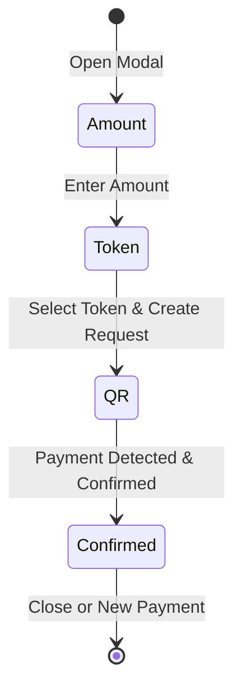

## Overview

The Walty POS (Point of Sale) system provides a mobile-friendly interface for merchants to accept cryptocurrency payments in person. Built around the `CollectModal` component, it guides customers through payment creation, QR code display, and real-time payment confirmation.

<Note>
The POS system is designed for business accounts and requires an unlocked merchant wallet to create payment requests.
</Note>

## CollectModal Component

The `CollectModal` is the core UI component for the POS system, located at `components/pos/CollectModal.tsx`.

### Props

```typescript
type CollectModalProps = {
  open: boolean
  onOpenChange: (open: boolean) => void
  merchantWalletAddress: string | null
  activeRequest?: PaymentRequestView | null
  onRequestChange?: (request: PaymentRequestView | null) => void
}
```

| Prop | Type | Description |
|------|------|-------------|
| `open` | `boolean` | Controls modal visibility |
| `onOpenChange` | `(open: boolean) => void` | Callback when modal opens/closes |
| `merchantWalletAddress` | `string \| null` | Unlocked wallet address for receiving payments |
| `activeRequest` | `PaymentRequestView \| null` | Existing payment request to display |
| `onRequestChange` | `(request: PaymentRequestView \| null) => void` | Callback when payment request updates |

## Payment Flow

The POS system follows a four-step workflow:



### Step 1: Amount Entry

<Steps>
  <Step title="Enter Payment Amount">
    The merchant enters the amount in USD using a numeric input field with dollar sign prefix.
  </Step>
  
  <Step title="Split Payment Option">
    Optionally enable **Split Payment** to allow multiple customers to contribute toward the total.
  </Step>
  
  <Step title="Validation">
    The "Continue" button is disabled until a valid amount > 0 is entered.
  </Step>
</Steps>

```typescript
// Amount validation
const amountValid = 
  amount !== "" && 
  !Number.isNaN(Number(amount)) && 
  Number(amount) > 0
```

### Step 2: Token Selection

<Steps>
  <Step title="Choose Payment Token">
    The merchant selects either **USDC** or **USDT** on Polygon network.
  </Step>
  
  <Step title="Create Payment Request">
    Clicking "Continue" sends a POST request to `/api/payment-requests` with:
    - `amountUsd`: The USD amount
    - `token`: Selected token symbol (`"USDC"` or `"USDT"`)
    - `merchantWalletAddress`: The unlocked wallet address
    - `isSplitPayment`: Boolean flag for split payments
  </Step>
</Steps>

<Warning>
If the merchant wallet is locked (`merchantWalletAddress === null`), the request creation will fail with an error message.
</Warning>

### Step 3: QR Code Display

Once the payment request is created, the modal displays:

<CardGroup cols={2}>
  <Card title="QR Code" icon="qrcode">
    A scannable QR code encoding the payment URL for mobile wallets
  </Card>
  <Card title="Merchant Address" icon="wallet">
    Truncated merchant wallet address with copy button
  </Card>
  <Card title="Payment Link" icon="link">
    Full public payment URL with copy and share options
  </Card>
  <Card title="Countdown Timer" icon="clock">
    Real-time countdown showing remaining time before expiry (MM:SS format)
  </Card>
</CardGroup>

#### QR Code Implementation

```typescript
import { QRCodeSVG } from "qrcode.react"

<QRCodeSVG 
  value={paymentUrl} 
  size={200} 
  level="M" 
  includeMargin={false} 
/>
```

The payment URL format:
```
https://yourdomain.com/pay/{requestId}
```

#### Split Payment Display

For split payments, the modal shows:
- **Total to pay**: Original requested amount
- **Total paid**: Sum of all confirmed contributions
- **Remaining**: Amount still needed
- **Contributions list**: Each payer's address, amount, status, and transaction hash

### Step 4: Payment Confirmation

The modal polls for payment updates every 3 seconds:

<Steps>
  <Step title="Polling Mechanism">
    The component fetches `/api/payment-requests/{id}` every 3 seconds while the request is `pending` or `confirming`.
  </Step>
  
  <Step title="Status Updates">
    The UI shows different indicators based on status:
    - **Pending**: "Waiting for payment..." with spinner
    - **Confirming**: "Payment detected · Confirming..." with confirmation count (`1/2`)
    - **Paid**: Success screen with checkmark
    - **Expired**: Error message with option to create new payment
  </Step>
  
  <Step title="Automatic Transition">
    When status changes to `"paid"`, the modal automatically transitions to the confirmation screen.
  </Step>
</Steps>

```typescript
// Polling implementation (simplified)
useEffect(() => {
  if (!request) return
  if (request.status !== "pending" && request.status !== "confirming") return

  const poll = async () => {
    const res = await fetch(`/api/payment-requests/${request.id}`)
    if (!res.ok) return
    const next = await res.json()
    setRequest(next)
    if (next.status === "paid") {
      setStep("confirmed")
    }
  }

  poll()
  const id = setInterval(poll, PAYMENT_MODAL_POLL_INTERVAL_MS)
  return () => clearInterval(id)
}, [request])
```

## Real-Time Features

### Countdown Timer

The modal displays a live countdown timer showing minutes and seconds until expiry:

```typescript
const countdown = getPaymentRequestCountdown(request.expiresAt, now)
// Returns: { expired: boolean, label: "14:32", seconds: 872 }
```

The countdown updates every second using a 1-second interval:

```typescript
useEffect(() => {
  if (!request) return
  const id = setInterval(() => setNow(Date.now()), 1_000)
  return () => clearInterval(id)
}, [request])
```

### Payment Status Indicators

| Status | UI Element | Visual |
|--------|------------|--------|
| Pending | Spinner + "Waiting for payment..." | Gray, animated |
| Confirming | Spinner + "Payment detected · Confirming..." | Amber, shows `N/2 confirmations` |
| Paid | Check circle + Amount | Green success |
| Expired | Error message + "Create new payment" button | Red destructive |

## Share and Copy Features

### Copy Merchant Address

```typescript
async function handleCopyAddress() {
  await copyToClipboard(request.merchantWalletAddress)
  setCopiedAddress(true)
  setTimeout(() => setCopiedAddress(false), 1_500)
}
```

### Copy Payment Link

```typescript
async function handleCopyLink() {
  await copyToClipboard(paymentUrl)
  setCopiedLink(true)
  setTimeout(() => setCopiedLink(false), 1_500)
}
```

### Share via Web Share API

On supported devices (mobile), the modal includes a "Share" button:

```typescript
const shareSupported = 
  typeof navigator !== "undefined" && 
  typeof navigator.share === "function"

async function handleShareLink() {
  await navigator.share({
    title: "Cobro Walty",
    text: getPaymentShareText(request, paymentUrl),
    url: paymentUrl,
  })
}
```

<Info>
The share text format is: `"Pagar ${amountUsd} ${tokenSymbol} en Walty: {url}"`
</Info>

## Split Payment Contributions

For split payments, the QR screen shows real-time contribution tracking:

```typescript
<div className="space-y-2">
  {request.contributions.map((contribution) => (
    <div key={contribution.id}>
      <span>{truncateAddress(contribution.payerAddress)}</span>
      <span>{contribution.amountUsd} {contribution.tokenSymbol}</span>
      <span className={getStatusColor(contribution.status)}>
        {contribution.status === "confirmed" ? "Confirmado" :
         contribution.status === "confirming" ? "Confirmando" :
         "Pendiente"}
      </span>
      {contribution.txHash && (
        <a href={getTxUrl(contribution.txHash, PAYMENT_CHAIN_ID)}>
          {truncateHash(contribution.txHash)}
        </a>
      )}
    </div>
  ))}
</div>
```

Each contribution shows:
- **Payer address**: Truncated wallet address (`0x742d…bEb`)
- **Amount**: USD value and token symbol
- **Status**: Pending, Confirming, or Confirmed with color coding
- **Transaction link**: Link to Polygon block explorer

## Payment Landing Page

When customers scan the QR code or click the payment link, they're directed to `/pay/{requestId}`, which displays:

<Steps>
  <Step title="Payment Details">
    - Amount in USD
    - Token symbol and network (Polygon)
    - Merchant wallet address (truncated)
    - Current status and countdown timer
  </Step>
  
  <Step title="Pay Button">
    - If not authenticated: "Log in to pay" (redirects to `/onboarding?next=/pay/{requestId}`)
    - If authenticated: "Pay now" (redirects to `/dashboard/pay/{requestId}`)
  </Step>
  
  <Step title="Real-Time Polling">
    The page polls for updates every 3 seconds and displays status changes (confirming, paid, expired).
  </Step>
</Steps>

<Warning>
If the payment request is already paid or expired, the landing page shows an error message: "This payment has already been paid" or "This payment has expired."
</Warning>

## Error Handling

### Wallet Not Unlocked

```typescript
if (!merchantWalletAddress) {
  setError("Desbloquea la wallet del comercio para crear el cobro.")
  return
}
```

### API Errors

```typescript
const res = await fetch("/api/payment-requests", {
  method: "POST",
  headers: { "Content-Type": "application/json" },
  body: JSON.stringify({ amountUsd, token, merchantWalletAddress, isSplitPayment }),
})

const data = await res.json()
if (!res.ok) {
  setError(data.error ?? "Error al crear el cobro")
  return
}
```

### Network Errors

```typescript
try {
  // API call
} catch {
  setError("Error de conexión")
} finally {
  setCreating(false)
}
```

## UI Components Used

<CardGroup cols={2}>
  <Card title="Dialog" icon="window">
    Shadcn UI Dialog component for modal container
  </Card>
  <Card title="Input" icon="keyboard">
    Numeric input with dollar sign prefix for amount entry
  </Card>
  <Card title="Button" icon="hand-pointer">
    Primary and outline button variants for actions
  </Card>
  <Card title="Spinner" icon="spinner">
    Loading indicator for pending and confirming states
  </Card>
</CardGroup>

### Icons (Phosphor)

- `ArrowClockwise`: Create new payment button
- `ArrowLeft`: Back navigation
- `Check`: Copy confirmation
- `CheckCircle`: Success states and selected items
- `Circle`: Unselected radio options
- `CopySimple`: Copy to clipboard actions
- `LinkSimple`: Payment link indicator
- `ShareNetwork`: Web Share API trigger
- `Users`: Split payment indicator

## Configuration Constants

```typescript
// Polling interval for payment updates in modal
export const PAYMENT_MODAL_POLL_INTERVAL_MS = 3_000

// Supported tokens
const TOKENS = ["USDC", "USDT"] as const

// Payment chain
export const PAYMENT_CHAIN_ID = 137 // Polygon
```

## Best Practices

<Steps>
  <Step title="Always Check Wallet Status">
    Ensure `merchantWalletAddress` is not `null` before opening the modal to prevent creation errors.
  </Step>
  
  <Step title="Handle Active Requests">
    Pass `activeRequest` prop to resume an existing payment instead of creating duplicate requests.
  </Step>
  
  <Step title="Listen to Status Changes">
    Use `onRequestChange` callback to update parent component state when payment status changes.
  </Step>
  
  <Step title="Clean Up on Close">
    The modal automatically resets local state when closed to ensure fresh state for the next payment.
  </Step>
</Steps>

## Integration Example

```typescript
import { CollectModal } from "@/components/pos/CollectModal"
import { useState } from "react"

export function POSPage() {
  const [modalOpen, setModalOpen] = useState(false)
  const [activeRequest, setActiveRequest] = useState(null)
  const merchantWallet = "0x742d35Cc6634C0532925a3b844Bc9e7595f0bEb"

  return (
    <>
      <button onClick={() => setModalOpen(true)}>
        Create Payment
      </button>
      
      <CollectModal
        open={modalOpen}
        onOpenChange={setModalOpen}
        merchantWalletAddress={merchantWallet}
        activeRequest={activeRequest}
        onRequestChange={setActiveRequest}
      />
    </>
  )
}
```

## Next Steps

<CardGroup cols={2}>
  <Card title="Payment Requests" icon="receipt" href="/business/payment-requests">
    Learn about the underlying payment request system and blockchain verification
  </Card>
  <Card title="Architecture" icon="building" href="/developer/architecture">
    Understand business account setup and system architecture
  </Card>
</CardGroup>